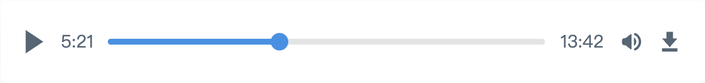

# "Easy Audio Player"

[English](README.md) | [中文](README.zh-cn.md)

## Introduction

Easy Audio Player is a simple audio player that supports Vue 3 and React.



## Installation

### Vue 3

```bash
# Using npm
npm install @hekeh/easy-audio-player-vue

# Using yarn
yarn add @hekeh/easy-audio-player-vue

# Using pnpm
pnpm add @hekeh/easy-audio-player-vue
```

### React

```bash
# Using npm
npm install @hekeh/easy-audio-player-react

# Using yarn
yarn add @hekeh/easy-audio-player-react

# Using pnpm
pnpm add @hekeh/easy-audio-player-react
```

## Parameters

| Parameter | Description           | Type                 | Required | Default                   |
| --------- | --------------------- | -------------------- | -------- | ------------------------- |
| url       | Audio URL             | `string`             | Yes      | -                         |
| options   | Configuration options | `AudioPlayerOptions` | No       | See options configuration |

### Options Configuration

| Parameter          | Description                           | Type      | Default |
| ------------------ | ------------------------------------- | --------- | ------- |
| stopOthersOnPlay   | Stop other audio players when playing | `boolean` | `true`  |
| showDownloadButton | Show download button                  | `boolean` | `true`  |
